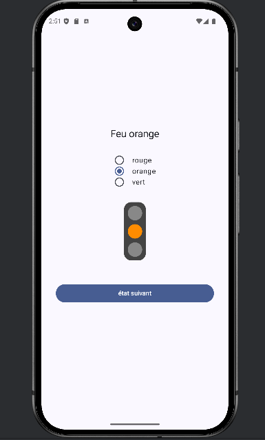
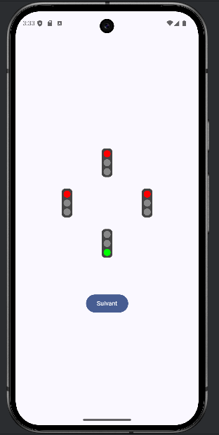

# Jetpack Compose: Android Programming Report

## Introduction

This report details the work completed during the TP6 practical session on Android programming using  **Jetpack Compose** , Google's recommended UI toolkit for building modern Android applications. The objective was to explore Jetpack Compose, understand its core concepts, and implement a traffic light system ("Feu3") and a crossroad ("Carrefour") application. Below, I explain the key concepts learned, the tasks performed, and the significant components implemented, with placeholders for relevant screenshots.

## 1. Project Setup and Initial Configuration

### 1.1 Creating the Project

I began by creating an Android project in Android Studio using the **Empty Activity** template with Jetpack Compose, named **TP4** (case-sensitive) with the pack name **fr.iutlan.tp4**. This ensured the project was set up with Compose as the UI framework.

### 1.2 Dependency Configuration

In the **app/build.gradle.kts** file, I added the dependency for **androidx.lifecycle:lifecycle-viewmodel-compose:2.8.7** to enable ViewModel integration with Compose. This dependency was transformed into a version catalog entry (**implementation(libs.androidx.lifecycle.viewmodel-compose)**) for better dependency management. I also resolved compilation issues on IUT machines by updating the Gradle dependencies for **coreKtx** to version **1.13.1** or **1.10.1** and **activityCompose** to **1.9.0**, followed by syncing the project.

## 2. Understanding Jetpack Compose

### 2.1 Core Concepts

Jetpack Compose introduces a declarative UI paradigm, fundamentally different from traditional Android Views. Instead of inflating XML layouts, Compose uses **composable functions** to build the UI programmatically. These functions:

* Are annotated with **@Composable**.
* Directly render UI components (e.g., **Text**, **Button**, **Column**) without creating objects.
* Are  **pure functions** , meaning they produce the same output for the same input and have no side effects on external data.

Unlike Android Views, there is no view binding or object setters in Compose. The UI is rebuilt (recomposed) when the underlying state changes, making it efficient and reactive.

### 2.2 Activity Structure

The main activity (**MainActivity**) extends **ComponentActivity** and uses the **setContent** function to define the UI. For example, I modified **MainActivity** to display a simple "Bonjour tout le monde!" text:

```kotlin
setContent {
    Text("Bonjour tout le monde!")
}
```

This demonstrated the use of **lambda expressions** in Kotlin, where **setContent** accepts a composable lambda without parameters. I also explored named parameters in composable functions, such as:

```kotlin
Text(
    text = "Bonjour tout le monde!",
    fontWeight = FontWeight.Bold,
    fontSize = 32.sp,
    color = Color.Magenta
)
```

This showed how Compose functions have multiple optional parameters with default values, allowing flexible UI customization.


### 2.3 Custom Composables and Previews

To enhance modularity, I created a custom composable function **Accueil**:

```kotlin
@Composable
fun Accueil(name: String) {
    Text(text = "Bonjour $name", fontSize = 20.sp)
}
```

This function was called in **MainActivity** with **Accueil(name = "numéro 6")**. I also added a preview function annotated with **@Preview** to visualize the UI in Android Studio's split mode:

```kotlin
@Preview
@Composable
fun AccueilPreview() {
    Accueil(name = "numéro 10")
}
```

This allowed me to see the UI without running the app on an emulator.

### 2.4 Layouts and Modifiers

Compose provides layout composables like **Column** and **Row** for arranging UI elements. I replaced the **Accueil** function to use a **Column**:

```kotlin
@Composable
fun Accueil(name: String) {
    Column {
        Text(text = "Bonjour $name", fontSize = 20.sp)
        Text(text = "Je vois de grands progrès", color = Color.Blue)
    }
}
```

I also used the **Modifier** parameter to control layout properties, such as:

```kotlin
Column(
    horizontalAlignment = Alignment.CenterHorizontally,
    modifier = Modifier
        .fillMaxWidth()
        .padding(8.dp)
)
```

Modifiers are chainable and reusable, allowing precise control over size, padding, and alignment. For example, **fillMaxWidth()** is equivalent to **match_parent** in Android Views, and **padding** adds internal spacing.


## 3. Implementing the Traffic Light System (Feu3)

### 3.1 MVC Pattern in Compose

The traffic light system followed the **Model-View-Controller (MVC)** pattern adapted for Compose:

* **Model** : A read-only data structure (**Feu3State**) representing the state.
* **View** : Composable functions (**Feu3ViewV1**, **Feu3ViewV2**, **Feu3ViewV3**) that display the state.
* **Controller** : A **ViewModel** (**Feu3ViewModel**) managing state changes.

### 3.2 Model (Feu3State)

I created **Feu3State.kt** in the **fr.iutlan.tp4.feu3.state** package to define the traffic light state:

```kotlin
package fr.iutlan.tp4.feu3.state

data class Feu3State(
    val rouge: Boolean = true,
    val orange: Boolean = false,
    val vert: Boolean = false
) {
    val nomCouleur: String
        get() = if (rouge) "rouge" else if (orange) "orange" else if (vert) "vert" else "???"
}
```

This **data class** uses read-only **val** properties to ensure immutability, with a computed property **nomCouleur** to return the current color name.

### 3.3 View (Feu3View)

I implemented multiple visualizations for the traffic light:

* **Feu3ViewV1** : Displays the color name as text.
* **Feu3ViewV2** : Uses **RadioButton** components to show the selected color.
* **Feu3ViewV3** : Draws colored circles using a **Canvas** composable.

For example, **Feu3ViewV3** uses a **Canvas** to draw circles representing the traffic light:

```kotlin
@Composable
fun Feu(color: Color, isOn: Boolean, modifier: Modifier = Modifier) {
    Canvas(
        modifier = Modifier.size(40.dp).padding(4.dp),
        onDraw = {
            drawCircle(color = if (isOn) color else Color.Gray)
        }
    )
}
```


### 3.4 Controller (Feu3ViewModel)

The **Feu3ViewModel** manages state changes:

```kotlin
class Feu3ViewModel : ViewModel() {
    private val _state = mutableStateOf(Feu3State())
    var state
        get() = _state.value
        private set(newstate) { _state.value = newstate }

    fun suivant() {
        state = with(state) {
            if (rouge) Feu3State(false, false, true)
            else if (vert) Feu3State(false, true, false)
            else Feu3State(true, false, false)
        }
    }
}
```

The **mutableStateOf** enables automatic recomposition when the state changes, and the **suivant()** method cycles through the traffic light states (red → green → orange → red).

### 3.5 Event Handling

I added a **Button** to trigger state changes:

```kotlin
Button(
    onClick = { viewmodel.suivant() },
    modifier = Modifier.fillMaxWidth().padding(32.dp)
) {
    Text(text = "état suivant")
}
```

This button calls the **suivant()** method in the **ViewModel**, updating the state and triggering UI recomposition.



### 3.6 State Evolution (Feu3StateV2)

To demonstrate model flexibility, I created **Feu3StateV2.kt** using an **enum** instead of booleans:

```kotlin
enum class FeuCouleur {
    ROUGE, ORANGE, VERT
}

data class Feu3State(
    val couleur: FeuCouleur = FeuCouleur.ROUGE
) {
    val nomCouleur: String get() = couleur.toString()
    val rouge get() = couleur == FeuCouleur.ROUGE
    val orange get() = couleur == FeuCouleur.ORANGE
    val vert get() = couleur == FeuCouleur.VERT
    fun copyChangeCouleur(nouvelle: FeuCouleur) = copy(couleur = nouvelle)
}
```

This change required updating the **Feu3ViewModel** to use **copyChangeCouleur**, but the views remained largely unaffected due to the added getters.

## 4. Implementing the Crossroad System (Carrefour)

### 4.1 Model (CarrefourState)

I created **CarrefourState.kt** to represent a crossroad with four traffic lights:

```kotlin
package fr.iutlan.tp4.carrefour.state

@Suppress("ArrayInDataClass")
data class CarrefourState(
    val courant: Int = 0,
    val feux: Array<Feu3State> = arrayOf(Feu3State(), Feu3State(), Feu3State(), Feu3State())
) {
    val feuCourant get() = feux[courant]

    fun copyChangeCouleurCourant(couleur: FeuCouleur): CarrefourState {
        val newFeux = feux.copyOf()
        newFeux[courant] = feux[courant].copyChangeCouleur(couleur)
        return copy(feux = newFeux)
    }

    fun copyChangeCourant(num: Int): CarrefourState {
        return copy(courant = (num % feux.size + feux.size) % feux.size)
    }
}
```

The **copyChangeCouleurCourant** and **copyChangeCourant** methods ensure immutability by creating new state instances.

### 4.2 Controller (CarrefourViewModel)

The **CarrefourViewModel** manages the crossroad logic:

```kotlin
class CarrefourViewModel : ViewModel() {
    private val _state = mutableStateOf(CarrefourState())
    var state
        get() = _state.value
        private set(newstate) { _state.value = newstate }

    fun suivant() {
        state = with(state) {
            if (feuCourant.rouge) copyChangeCouleurCourant(FeuCouleur.VERT)
            else if (feuCourant.vert) copyChangeCouleurCourant(FeuCouleur.ORANGE)
            else copyChangeCourant(courant + 1)
        }
    }
}
```

The **suivant()** method implements the rules: red → green → orange → next light.

### 4.3 View (CarrefourView)

The **CarrefourView** displays four traffic lights arranged in a cross:

```kotlin
@Composable
fun CarrefourView(state: CarrefourState, modifier: Modifier = Modifier, size: Dp = 180.dp) {
    Box(
        modifier.fillMaxWidth().padding(60.dp)
    ) {
        val mod = Modifier.scale(0.5f).align(Alignment.Center)
        Feu3ViewV3(state = state.feux[0], modifier = mod.offset(y = -size))
        Feu3ViewV3(state = state.feux[1], modifier = mod.offset(x = size))
        Feu3ViewV3(state = state.feux[2], modifier = mod.offset(y = size))
        Feu3ViewV3(state = state.feux[3], modifier = mod.offset(x = -size))
    }
}
```

The **offset** modifier positions the lights around the center to form a cross.



## 5. Key Learnings

* **Declarative UI** : Compose's declarative approach simplifies UI development by directly mapping state to UI components.
* **Immutability** : Using immutable data classes ensures predictable state management and prevents unintended side effects.
* **Recomposition** : Compose efficiently updates the UI by recomposing only the changed components.
* **MVC Pattern** : The separation of model, view, and controller enhances modularity and maintainability.
* **Modifiers** : Provide a flexible way to customize layout and appearance.
* **Preview Annotations** : Enable rapid UI prototyping without running the app.

## 6. Conclusion

This TP6 session provided a comprehensive introduction to Jetpack Compose, from setting up a project to implementing a complex crossroad system. By building the traffic light and crossroad applications, I gained a deep understanding of Compose's declarative nature, state management, and the MVC pattern. The use of immutable data, composable functions, and ViewModels ensures robust and maintainable code. The project successfully demonstrated how to create dynamic, interactive UIs while adhering to modern Android development practices.
